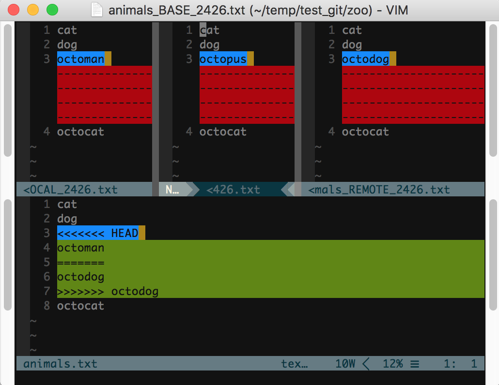

# Version Control

My first choice of version control software is git, it is obvious since I am hosting this site on github.

It is nice when many weeks or months later, when you find an error you made which should not be there,
you would want to go back like in a time travel, to find where did it begin. Version control allows you
to do that. 

And it is also a good place to hold collaborative works while every one can contribute there
own thoughts and merge them together. Somebody might say not MS Word, Apple Pages or Google Docs can already
do that in real time. But for coding, you wouldn't want to be supprised when somebody added a line of code
that would break when you want to test the changes you made just a while ago.

Actually, this is not a perfect justification. But, anyway, the ability to track changes and manipulate 
changes is really awesome.

To find out all about git one can refer to the [git-scm](https://git-scm.com/doc) website, where there are
[man pages](https://git-scm.com/docs) and 
[cheat sheet](https://services.github.com/on-demand/downloads/github-git-cheat-sheet.pdf). Man pages are also
accessible in `man` command.

Here we are going to introduce a few tweeks and about merge/cherry-pick. I probably would give a more detailed
and plain introduction to each git command in the future.


## A few settings

* When viewing the history of a repository, one usually use `git log`. But it prints out very few entries and each
of them spans many lines with redundant information. Many gui git software offers a tree graph to show how branches
and commits relate to each other, it is also achievable in command line:

    ```bash
    git config --global alias.lgb "log --graph --all --format='%Cred %h %C(white) %s %Cgreen(%cr)%C(cyan) <%an>%C(bold yellow)%d%Creset'"
    ```

    Then, `git lgb` would show vividly a tree of commits with one line for each. This contains a lot more information 
    and much more fancy.

* For version controling large files, there is an extension called [git-lfs](https://git-lfs.github.com/)

* To look at the changes in the git one can use `git diff`, but this kind of plain print out may be hard to 
read when there are a lot of changes. Then, `vimdiff` comes handy in showing the difference in files. `vimdiff`
works with git in `git difftool`, the following tweek would make work seamlessly:

    ```bash
    git config --global diff.tool vimdiff # Set default difftool to be vimdiff
    git config --global difftool.prompt false # Disable prompt and go directly into vimdiff
    git config --global alias.d difftool # Create the alias d for difftool
    ```

* When it comes to merge, resolving conflicts also requires a good tool, so that we don't get frustrated.

    ```bash
    git config --global merge.tool vimdiff # Use vimdiff to resolve conflicts
    git config --global mergetool.prompt false # Disable prompt
    ```

## Partial commit

Sometimes when you are editing a file, you know part of them are right but not sure for the other part. It'll be great
that you can just commit the part you are confident about and then go back to deal with the rest. There are two ways to
make this happen, the first is in the command line, and the second is in vim with vim-fugitive.

In command line, one just need to use the command

```bash
git add -p <file>
```

and follow the instructions.

But if you are currently in vim and do not want to quit the program to commit it, then you need to first go to the diff
mode with vim command

```vim
Gdiff
```

make sure you are in the right panel which shows the current file. Visual select the part you want to commit and type the
command

```vim
diffput
```

then just save the index file on the left and quit. Now if you take a look at the status with 

```vim
Gstatus
```

you would see that you just staged the part of the file you just selected. And afterwards you can use `Gcommit` to commit it.


## Git merge

When git itself can automatically handle the changes in the merge, it is quite easy and we only need to choose whether 
to creat a new commit or not.

But when two distinct changes are made to the same place in the same file, human interference is required since git can not
decide for you.

The most basic way is just go into the file, find where git has marked as conflict, and make the changes. This requires one to carefully comb through lines to find the marks and change them to the desired state.

But sometimes one want to have both version presented and then change to a intermediate state or just keep one of them, 
it will be much more productive to have a tool to help you with that. Now you have followed the [previous section](#a-few-settings),
mergetool is ready with vimdiff to help you resolve conflicts.

Here I am using the same example from [this](http://www.rosipov.com/blog/use-vimdiff-as-git-mergetool) website.

```bash
#!/bin/bash
mkdir zoo
cd zoo
git init
cat > animals.txt << EOF
cat
dog
octopus
octocat
EOF
git add animals.txt
git commit -m "Initial commit"
git branch octodog
git checkout octodog
sed -i.bak 's/octopus/octodog/' animals.txt  # let's change octopus to octodog
git add animals.txt
git commit -m "Replace octopus with an octodog"
git checkout master
sed -i.bak 's/octopus/octoman/' animals.txt  # let's change octopus to octoman
git add animals.txt
git commit -m "Replace octopus with an octoman"
git merge octodog  # merge octodog into master
```
(`.bak` after the `-i` is for BSD `sed` in MacOS system.)



In this stage, the buffer is define as follows

<table>
  <tr>
    <td>Local</td>
    <td>Base</td>
    <td>Remote</td>
  </tr>
  <tr>
    <td colspan="3" align="center">Merged</td>
  </tr>
</table>

* Local: The version on you current branch just before merge.

* Base: The version on the last commit both branch share.

* Remote: The verion on the branch you are mergin in.

* Merged: The result of the merge.

Now, make sure your curser is in the `Merged` buffer, and we can proceed. In this 
example we only have one place of conflict, but if you happen to have multiple 
conflicts (hopefully not), attend to each of them respectively. Let's move to the
region marked but `git merge`, if you want to take any of the three version in above
buffers, just use the following command:
```vim
diffget LO "For Local
diffget BA "For Base
diffget Re "For Remote
```

If you want neither, simply delete this whole region and add the lines you desire.

Then hit `:wqa` to quit the mergetool, and the result will be automatically staged.


---
[←](README.md) • [↑](#remote-access) • [Github](https://github.com/lyuwen/terminal_guide)

Copyright (C) 2018 by Lyuwen Fu
